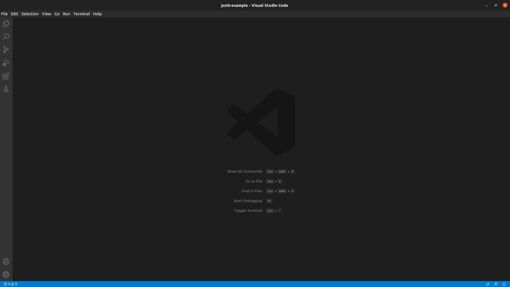
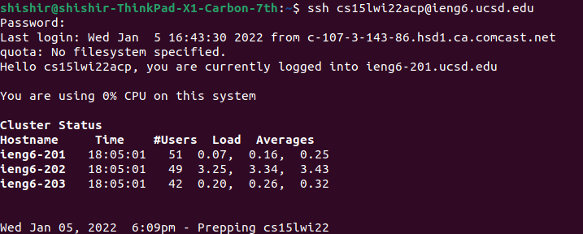
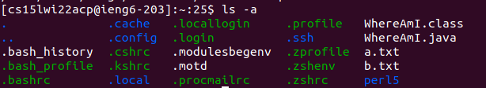
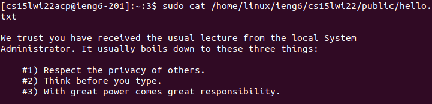
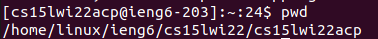
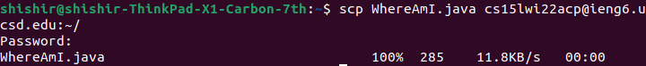
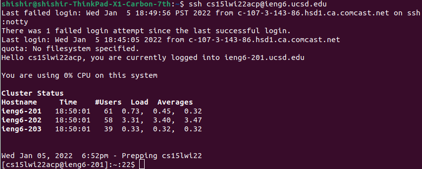
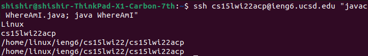

Logging into a course-specific account on `ieng6` via SSH
======================================================

Installing VS Code
------------------

While not absolutely necessary, VS Code includes a terminal from where we can run our commands. I did not find myself needing to use it, however, and you could just as easily use the built in terminal on your computer.

In order to download the appropriate version for your operating system, visit https://code.visualstudio.com/.

Once it's set up it should look something like this:

Remotely Connecting
--------------------

In order to connect to the `ieng6` computers, we can use SSH. Simply type the following command into the terminal: `ssh cs15lwi22***@ieng6.ucsd.edu`, where *** represents the 3 letters of your course-specific account. Note that you have to change your password in order to activate your course-specific account. This change takes about 15 minutes to take effect.

Once it prompts you for your password, type in the new password you made. If everything goes successful, you should see something like this:

Trying Some Commands
-------------------

There are various useful commands on the terminal that we can also run on the remote server. Some examples include:
 - `ls` - Lists the contents of the current working directory
 - `cat` - Prints out the contents of the specified file
 - `pwd` - Prints the full path of the current working directory

Here's what running these commands might look like:

`ls -a`: 

`cat`: 

`pwd`: 

Moving Files with `scp`
-----------------------

`scp`, which stands for "secure copy" (not to be confused with "secure contain protect"), is a useful way to copy files over from your local machine (the client) to the remote machine (the server). Its format is as follows:

`scp <filename> cs15lwi22***@ieng6.ucsd.edu`

Once again, *** represents the 3 letters in your course-specific id. When running this command you will be prompted with your password so be prepared to enter it.

If everything goes well you should see something like this:

Setting an SSH Key
-------------------

We can speed things up by using an SSH keypair, which generates both a public and a private key. The private key remains on your local machine, while the public key is copied to the server. By doing this, you can avoid having to type your password every time you try to log in or use `scp`.

To do this, we first run the command `ssh-keygen` and specify the location we want to store the newly generated key. We aren't quite finished yet, and when we try to `ssh` into the server again, we still need to type in our password. Once we're in the server though, we need to create a new directory to store our public key. Simply run `mkdir .ssh`, which creates a new directory called `.ssh`.

Then, log out of the server and use `scp` to copy the public key to the new directory we created as follows:

`scp ~/.ssh/id_rsa.pub cs15lwi22***@ieng6.ucsd.edu:~/ssh/authorized_keys`

Make sure you remember to replace *** with your course-specific id!

Anyway, enter your password when prompted and wait for the files to copy. If everything goes well you should be able to log in the next time without your password like so:

Optimizing Remote Running
-------------------------

There are ways we can run our programs on the remote server even quicker. With the syntax `ssh cs15lwi22***@ieng6.ucsd.edu <some command>`, you actually log into the server, run the specified command, and then log out - allowing you to fit three commands in one. With semicolons, it's possible to fit even more commands on one line.

With this in mind, we can use the following command for running a Java program quicker (provided it has already been copied onto the server):

Given the output of the program (which prints the username and directory from which it's run), we still run our program from the remote server, but we skip having to log in and type each command separately.

Conclusion
----------

Whoever's reading this, I hope you find this helpful. And if you didn't, why did you waste time reading all the way to the end? 