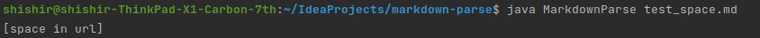
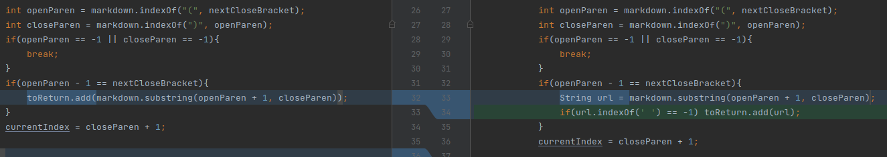
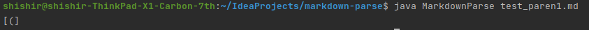
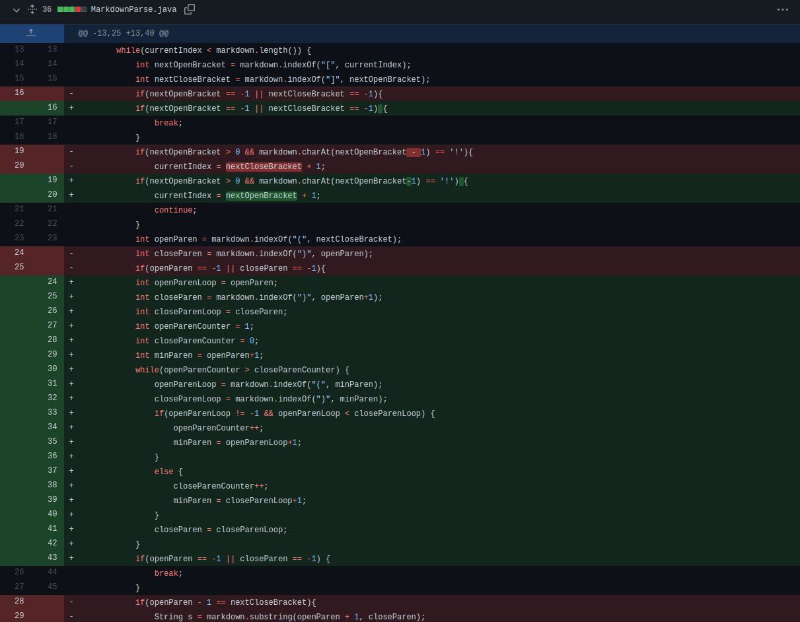

Failure Inducing Input, Bugs, and Symptoms on Markdown Parse
===================================

Note: Our group only had two main commits that fixed bugs in the original code. Therefore, these are the only code changes that will be shown here.

Code Change #1
--------------------

 - **Failure Inducing Input** - [Here](https://github.com/alien-traveler/markdown-parse/blob/main/test3.md) is a test file for which the original code would fail, producing the output shown below.

 - **Code Change Difference**

 - **Relationship between Failure Inducing Input, Bugs, and Symptoms** - The failure-inducing input contains no brackets or links, so the original program would be unable to find them and thus throw an exception as shown above, which is a symptom. The underlying bug was the fact that the program looked for brackets via `indexOf()` and then used the values it got regardless of whether brackets were actually present, leading to an `IndexOutOfBounds` exception.

Code Change #2
----------------

- **Failure Inducing Input** - [Here](test_space.txt) is a test file for which the original code would fail, producing the output shown below.

- **Code Change Difference**

- **Relationship between Failure Inducing Input, Bugs, and Symptoms** - The 
  failure-inducing input contained a "URL" with a space in it, so the 
  original program would mistake it for a URL and add it to the list, which 
  is a symptom. The underlying bug was the fact that the program didn't first check whether there were spaces in the URL.

Code Change #3
-----------------

 - **Failure Inducing Input** - [Here](https://github.
   com/shishir03/markdown-parse/blob/main/test_paren1.md) is a test file for 
   which the original code would fail, producing the output shown below.

 - **Code Change Difference**

 - **Relationship between Failure Inducing Input, Bugs, and Symptoms** - The 
   failure-inducing input contained a URL with mismatched open and close 
   parentheses - specifically, there were two open parentheses and one close 
   parenthesis, causing an open parenthesis to be included in the list of 
   URLs when it should actually be invalid. The underlying bug was the fact 
   that the program originally interpreted everything between a set of 
   parentheses as a link and didn't check whether there were any more 
   parentheses inside.