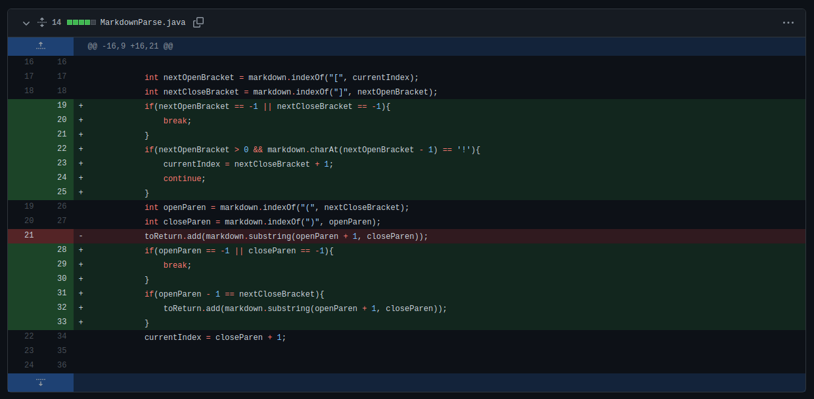
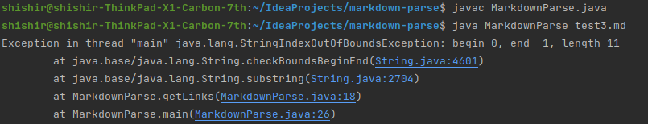

Failure Inducing Input, Bugs, and Symptoms on Markdown Parse
===================================

Note: Our group only had one main commit that fixed bugs in the original code. Therefore, this is the only code change that will be shown here.

Code Change Difference
-----------------

Failure Inducing Input
--------------------

[Here](https://github.com/alien-traveler/markdown-parse/blob/main/test3.md) is a test file for which the original code would fail; it contains no brackets or links, so the original program would be unable to find them and thus throw an exception as shown below.

Conclusion
----------

The potential failure inducing output was a way for our group to figure out whether there were any bugs present in the code, and in this case there were. The presence of a symptom, which in this case was the exception, allowed us to discover that there was a bug, and closely examining the output helped us figure out where it was.
