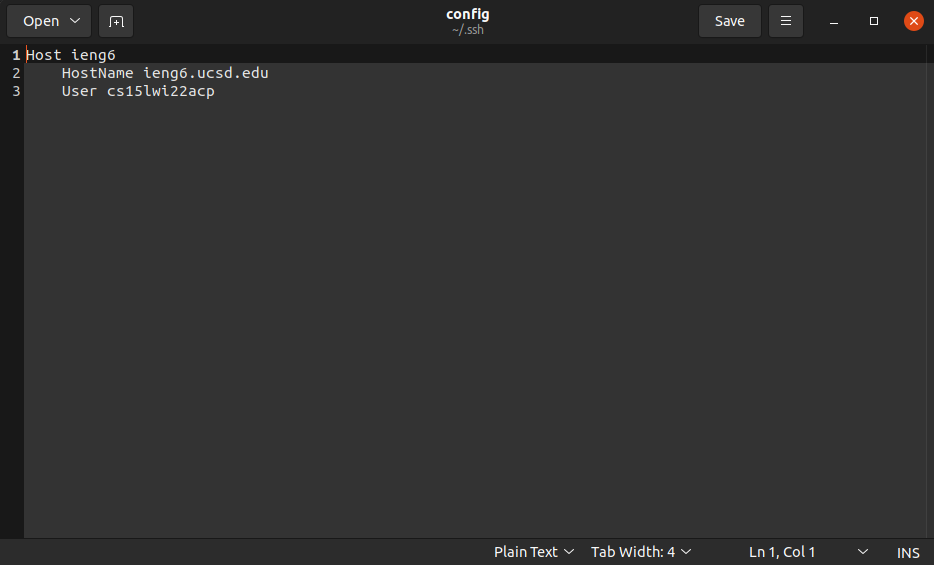
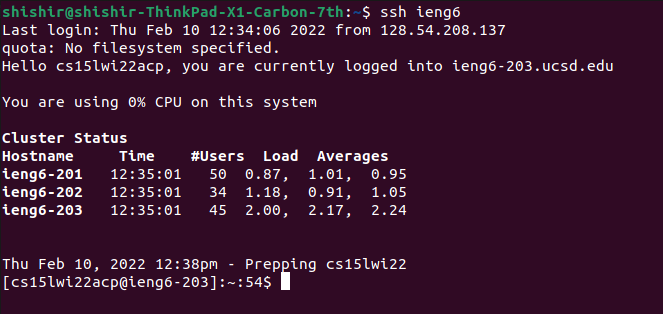
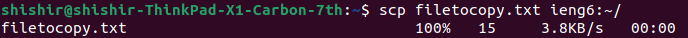
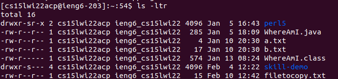

Streamlining SSH Configuration
=================================

Here's what my version of `~/.ssh/config` looks like (here I use the default 
text editor on Ubuntu, Gedit, to edit it).

Logging into ieng6 with the alias I chose looks something like this:

This is what using `scp` with our new alias might look like:

Logging into ieng6, we can see that the file has indeed been successfully 
copied.

