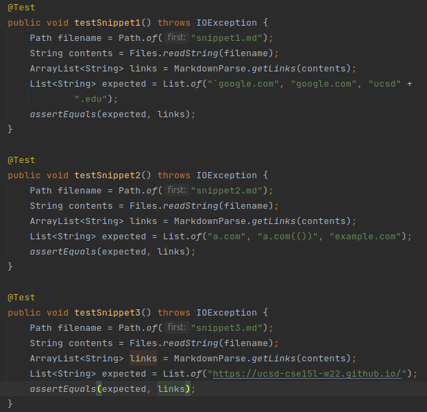
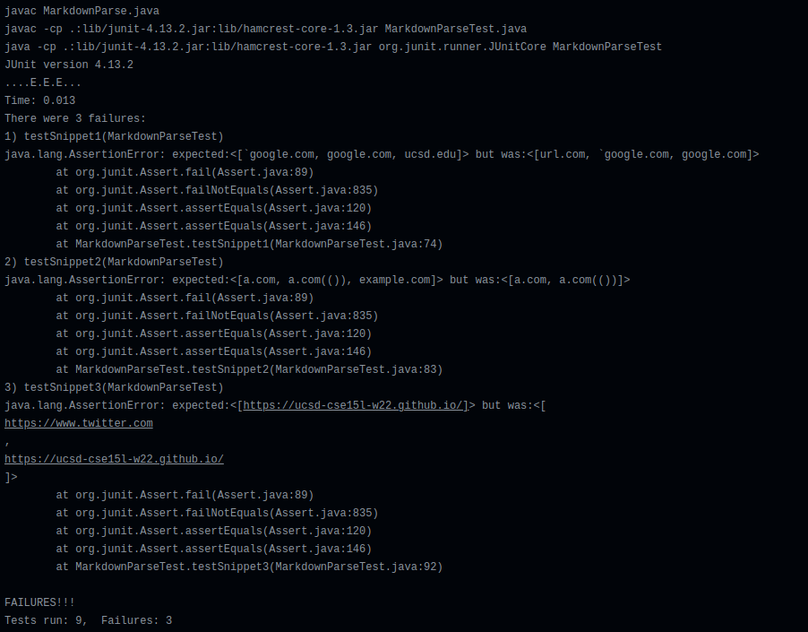
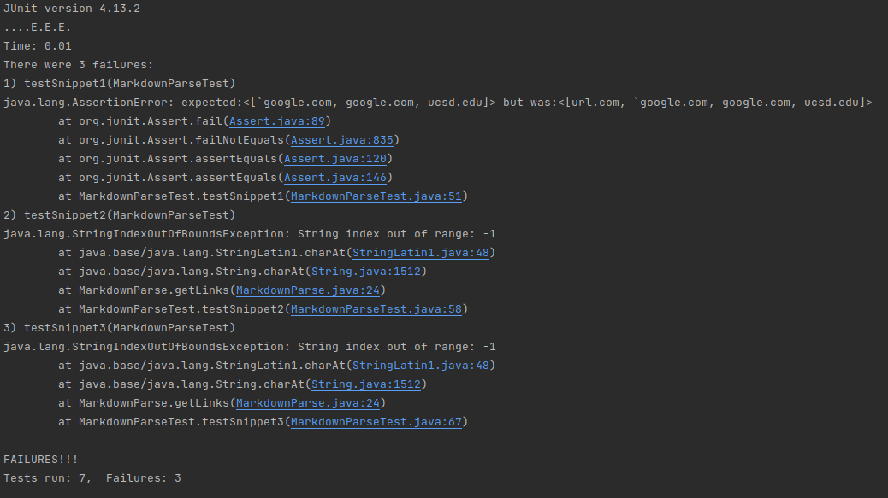
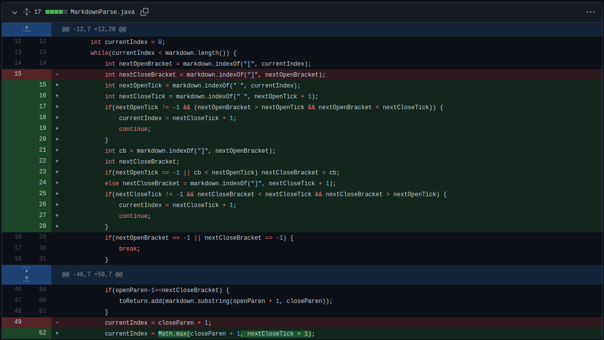
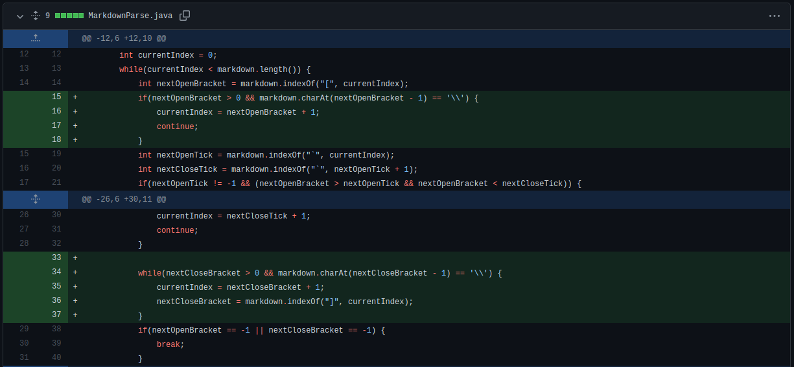
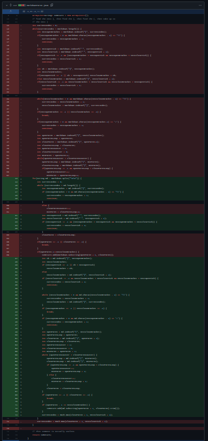

Three new `markdown-parse` tests
===================================

[Link to my `markdown-parse` repository](https://github.com/shishir03/markdown-parse)

[Link to the `markdown-parse` repository I reviewed](https://github.com/TheZenMasterz/markdown-parse)

For these tests, I determine the expected output using the VS Code markdown 
preview. 

Here's what the tests in `MarkdownParseTest.java` for the three code 
snippets look like:

This is the output of my implementation's JUnit tests for the three snippets;
none of them pass.

Meanwhile, here is the output of the JUnit tests on the implementation I 
reviewed for the three snippets; once again, none of the tests pass.

Code Changes
--------------------
 - **Snippet 1**: While this code change ended up being 14 lines, I was able 
   to handle inline code with backticks as shown in snippet 1 by adding 
   logic to check whether the next open or close bracket was between two 
   backticks. If the next open bracket was inside backticks, I simply used 
   `continue` to start the loop over. Meanwhile, if the next close bracket 
   was inside backticks, I looked for the next close bracket outside the 
   backticks. Finally, I slightly altered the change for `currentIndex` at 
   the end of the loop in order to make sure that it did not advance to a 
   point before a closing backtick.

 - **Snippet 2**: Since my code already worked for nested brackets and 
   parentheses, this was not a very large code change, and I only had to 
   make sure I handled escaped brackets. To do this, I simply checked the 
   index before an open or close bracket (if it was nonzero) to determine 
   whether it was escaped with a backslash. I used a while loop to find the 
   first non-escaped close bracket.

 - **Snippet 3**: I technically ended up changing around 50 lines of code to 
   make this change, but the changes themselves were not too major. In order 
   to handle line breaks, I split the markdown input string with two newlines
   (`"\n\n"`) in order to loop through each paragraph of the text. This way, 
   links spread over multiple paragraphs would not be counted, but links 
   with only one newline in the link text or body would. Finally, I used `.trim()` on the final link substring in order to remove any newline 
   characters at the ends. As for the reason I ended up changing 50 lines of 
   code, I had to change all instances of the variable `markdown` in my code 
   to the new loop variable I was using to keep track of each paragraph. 
   (I'll provide a screenshot but good luck seeing anything).

