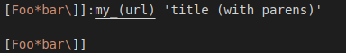
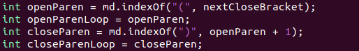
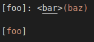
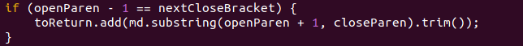

Differences in implementations using common-mark spec tests
=============================================================

Using the large amount of common-mark spec tests that were provided, between 
my implementation of `markdown-parse` and the shared implementation, there 
were 26 differences. In this lab report I'll be discussing two differences, 
on the test files `194.md` and `201.md`.

`194.md`
----------

`194.md` looks like the following:

Its expected output is `["my_(url)"]`. However, neither the shared 
implementation nor my implementation does not produce this output. The shared 
implementation outputs `["url"]`, while my implementation does not find any 
links. This is most likely because my implementation does not recognize that 
a colon after the link with the link text after it is also a valid way to 
represent a link. Therefore, I would have to check if there is a colon after 
the last close bracket and determine whether there is any text after it. 
This check would probably go somewhere in the code shown below.

`201.md`
-----------

`201.md` looks like the following:

There are no links in this file, but the implementation provided outputs `
["baz"]`, while my implementation correctly does not output anything. The 
reason for this is most likely because the provided implementation does not 
check the spacing between the close bracket and the open parentheses, so it 
interprets anything in parentheses after a set of brackets as a link, 
regardless of whether there's anything between them. One way to fix this 
would be to ensure that `openParen` is equal to `1 + nextCloseBracket` like 
below.

